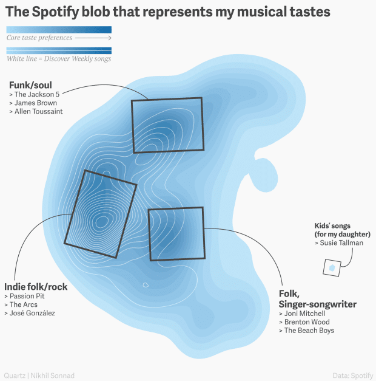
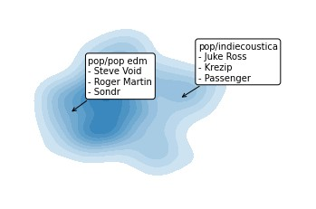
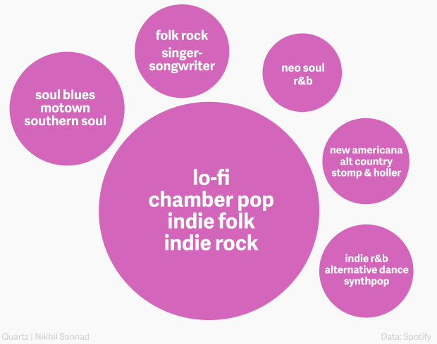
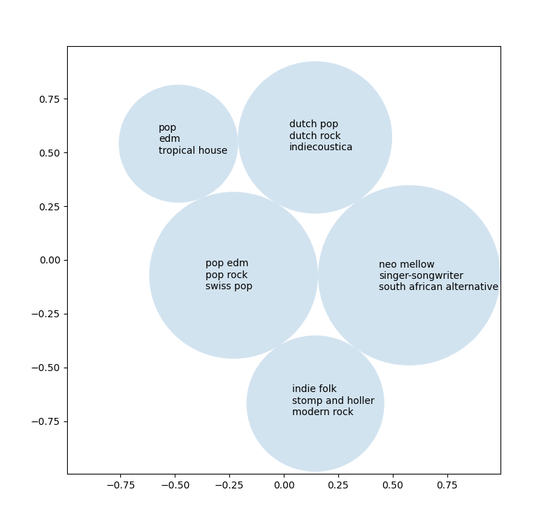

## Carlos: An exploration of Spotify's personalization processes




Spotify launched their Discover Weekly playlists in 2015, and it has been a great success. The secret? A mixture of collaborative filtering with music from other users, and a profile of each user’s music tastes. A Quartz Editor got an exclusive look into the inner workings of the system and a beautiful visual representation of their taste profile.

Carlos is a study into the various methods used in Spotify's personalization algorithms, from the clustering that creates a user's taste profiles, collaborative filtering for song recomendations, other considerations like NLP and audio analysis. I'll be using Python to construct and verify the algorithms, documenting my process in Jupyter notebooks. I'll recreate those algorithms in JavaScript to give Whisperify users the ability to analyze these features. 

Of course, I don't have access to as much data as Spotify, or the advanced deep learning knowledge to actually recreate the algorithms. I'll be using common machine learning methods and libraries to create a primitive copy of those processes as described in online resources for Spotify's personalization and recommendation system. 




### Running the project
The Jupyter notebooks are available to view directly through Github. If interested in running it locally, you should have Jupyter installed. Run `pip install jupyter` to install. 

Start the notebook with `jupyter notebook`

To run the notebook and the Python scripts with your own Spotify data, create a `.env` file in `/python` with the content below. You'll need to create a [Spotify application](https://developer.spotify.com/dashboard/) to get the id and secret. 
```
CLIENT_ID="your_spotify_app_id"
CLIENT_SECRET="your_spotify_app_secret"
USERNAME="your_spotify_username"
```

**Generating visualizations**

There are two ways to do so. 
1. Open `spotify-taste-clustering.ipynb` through Jupyter and run the notebook, reading the inner workings step-by-step. 
2. Run `datasetup.py` followed by `kmeans.py` to plot those graphs directly in Python. 
